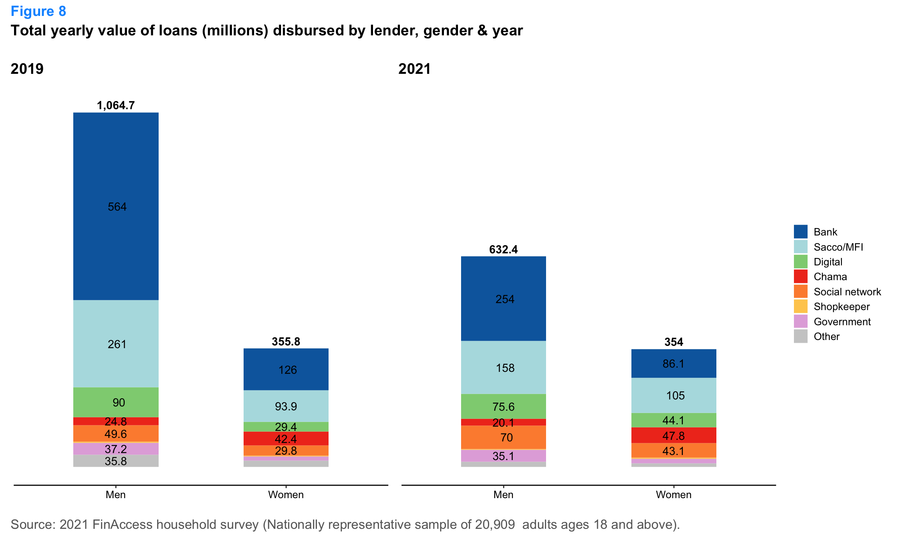
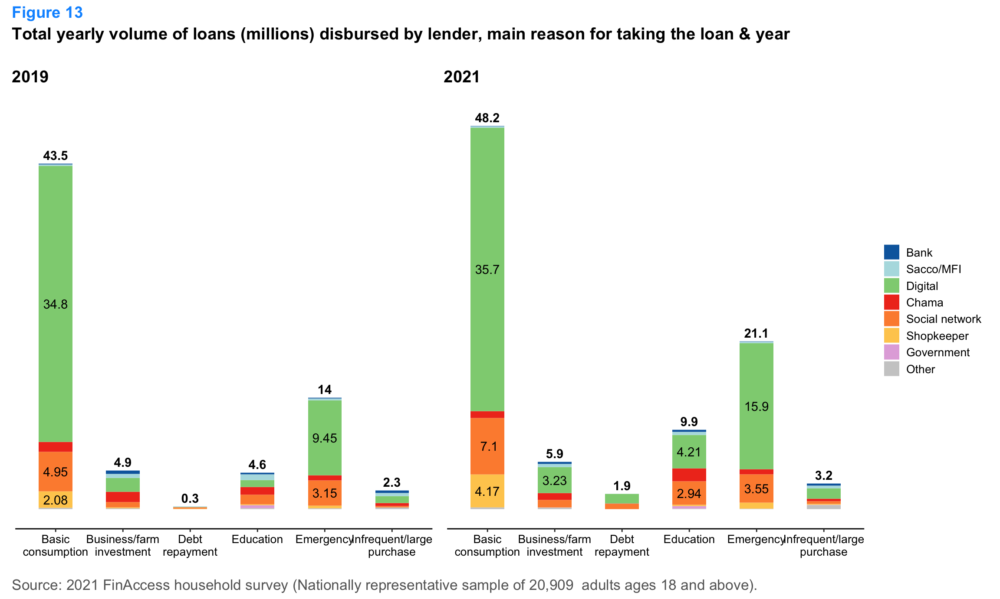
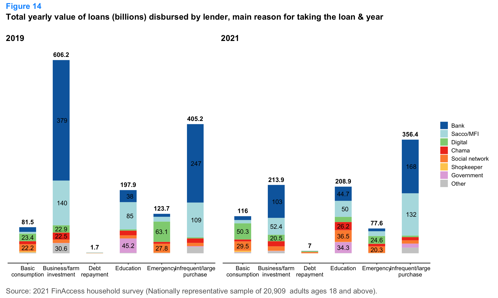
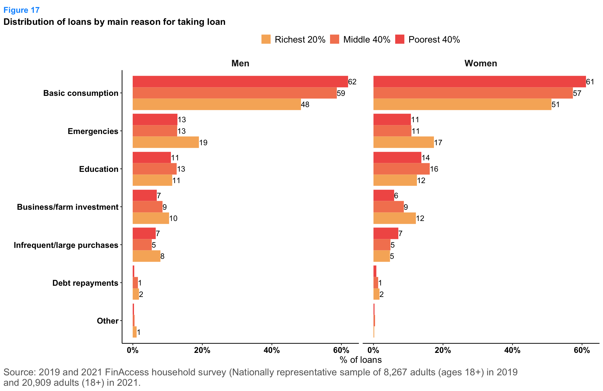
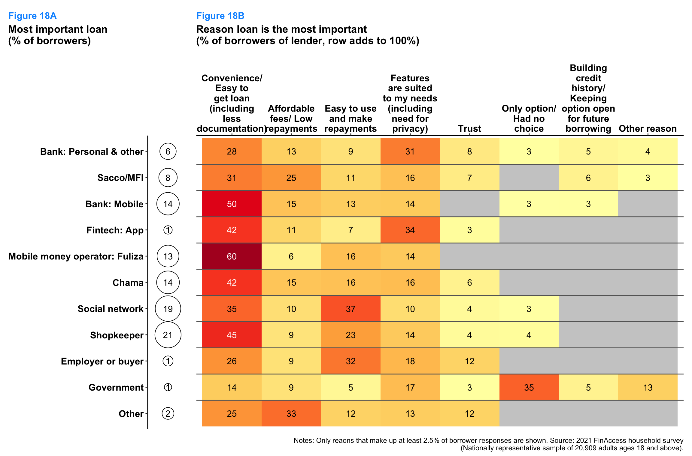
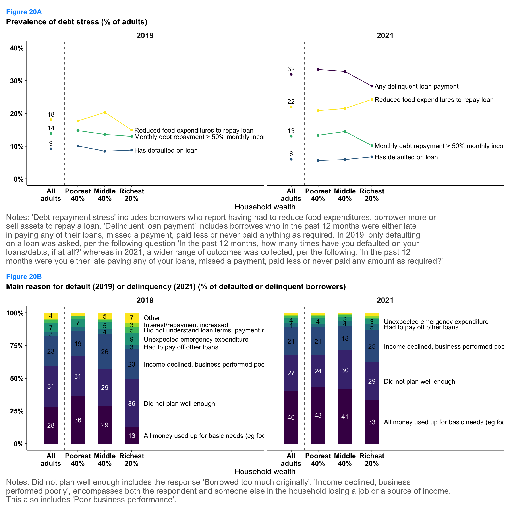

## Summary 

**Credit conditions during COVID-19 tightened substantially**. The market for credit experienced a sharp contraction in 2021 in concert with the economic slowdown resulting from the direct and indirect impacts of COVID-19. Despite an increase in the number of adults needing credit, the supply of credit fell. Between 2019 and 2021, the share of adults who had either attempted to borrow or were currently borrowing in the past year rose from 52 to 56%. However, over this period the total *number* of loans disbursed across all lenders declined by 10% and the total *value* of loans disbursed fell by 30%. Bank lending in particular pulled back significantly. Total bank lending to adults fell by 50% (KSh 350 billion), and this was almost entirely a reduction in lending to business owners. Lending to employed adults remained steady at KSh 258 billion in both 2019 and 2021. Other formal financial institutions also reduced lending during this period, but to a lesser degree. While total disbursements from Saccos and MFIs declined by 25 percent, their importance to business owners grew in relative terms: In 2019, the ratio of bank to Sacco/MFI loan disbursements to business owners was 7 to 1 by 2021 the ratio was 1 to 1. With more adults in need of credit and formal institutions less likely to provide financing, more borrowers (especially those among the poorest 40% and richest 20% of households) leaned on social networks to meet liquidity needs. Loans from friends, family members or neighbors rose by Ksh 33 billion (from Ksh 80 to 113 billion) between 2019 and 2021. 

**Digital lending options continue to expand and uncover massive demand for short-term liquidity**. In 2021, two-thirds of the close to 80 million cash loans disbursed to Kenyan adults were mediated through digital technologies, 30% were mediated through informal or relational agreements and 5% were mediated through traditional loan contracts at a financial institution. Fuliza alone accounted for 54% of all loans disbursed in 2021, reflecting rapid adoption of the service which was launched in early 2019. In 2021, Fuliza was used by nearly 1 in 5 adults who typically borrowed Ksh 500, 7 times a year. The data suggest that Fuliza partially displaced the practice of taking goods on credit from shopkeepers (informal buy now pay later), as well as other digital lending options such as loans from mobile banking services and fintech apps. For example, the share of low-value credit (under KSh 2,500) from shopkeepers fell from 34 to 23 percent just as the share of digital loans (including Fuliza) rose from 12 to 24 percent between 2019 and 2021. 

**A rising share of adults are indebted and a significant share show signs of debt stress**. Between 2019 and 2021, the share of adults with some outstanding debt increased by 22 percent, such that in 2021 nearly 50 percent of adults were carrying debt. Over this period, the share of adults reporting that they had to reduce food spending to repay a loan rose from 18 to 22%, with the largest increase among adults in the richest 20% of households (the share reporting having to cut food expenses to repay a loan rose from 15 to 25% from 2019 to 2021). 

## Introduction

The objective of this brief is to use the FinAccess nationally representative survey data to describe the market for credit in Kenya and it dynamics over the COVID-19 pandemic period. How many adults use loans? Where do they borrow from? How much and why do they borrow? It is important to note the strengths and limitations of survey data in describing the market for loans.  Comparisons of the volume and value of loans disbursed by providers from FinAccess with data collected and published by financial service providers or regulators in annual reports or financial statements will not necessarily align. There are several reasons that measures of loan disbursements by volume or value can be misaligned between demand-side data (like FinAccess) and supply-side sources. A few reasons are outlined below and an illustrative example comparing the demand- and supply-side estimates of the value of annual loan disbursements from M-Shwari and Fuliza is provided thereafter. 

* **Universe of inference**: Given that FinAccess is a household survey that captures the adoption and use of financial services at the level of individuals, it will not capture the borrowing behavior of large formal firms or other institutional entities and may only partially capture the borrowing behavior of smaller, domestic, firms and owner-operated businesses whose owners would be included in the survey. 
* **Survey sampling bias**: While the FinAccess survey is designed to be nationally representative using the latest (2019) Census list of households as a sampling frame, surveys do tend to under-represent individuals at the extreme upper-end of the income distribution. To the extent that borrowing from certain types of providers (e.g. banks) or credit instruments (e.g. mortgages) is concentrated at the upper-end of the income distribution, a survey like FinAccess may under-count the number of borrowers of services that adopted more widely or intensively by wealthier households.  
* **Survey measurement error**: In addition to statistical sampling error which arises due to the the variation in estimates of a population parameter from samples, responses to questions in surveys can also be subject to biases. For example, to measure borrowing activity, FinAccess asks respondents to recall whether they have taken a loan from a particular provider, how much was borrowed and how many loans were taken, over a period of time. The details of a large personal bank loan or mortgage taken one or two months ago are easier to remember than the total number of purchases made on a credit card or the number of times someone has borrowed from a shopkeeper over the past year.
* **Reference-period**: The reference period for measures of the credit market obtained from the FinAccess survey correspond to the 12-month period prior to the date of data collection. For example, for the 2021 FinAccess survey the reference period over which borrowing activity is measured is June-September 2020 through June-September 2021. Data supplied in annual reports from providers is usually aligned with their fiscal year. 

Measures of the market for credit from FinAccess are not a substitute for measures obtained from supply-side sources. However, they are complementary and offer a view of the market that supply side data sources cannot provide. For example, published publicly available supply-side figures rarely disaggregate indicators across key socio-economic and demographic characteristics, such as gender, income, geographic location and age. Demand-side data provides a comprehensive view of borrowing behavior that spans use of loans from both formal and informal sources of credit. In addition surveys provide data that can better help contextualize the demand for lending, such as the reasons individuals are borrowing and whether borrowers are having difficulty repaying. 

The author highlights the limitations of survey data in the context of understanding the composition and dynamics of credit markets in Kenya to remind readers that for many questions, any single source or piece of data offers only partial or incomplete answers and encourages readers to build a portfolio of evidence that includes data published from administrative sources. 

### Fuliza and M-Shwari
This report uses several questions from FinAccess to estimate the annual market for loans by volume and value for a range of credit providers. The figure below shows FinAccess estimates for the total value of Fuliza and M-Shwari annual loan disbursements alongside those reported by Safaricom in its annual sustainability report. There is a very large difference in the value of yearly borrowing from Fuliza: FinAccess measured a total of KSh 53 billion in loans disbursed between September 2020 through September 2021. By March 30th, 2021 Safaricom reported KSh 351 billion in loans, over 6 times the value reported in FinAccess. The differences are much smaller with M-Shwari.

::: {.cell}
::: {.cell-output-display}
{#fig-fuliza_favsaf width=1152}
:::
:::

What might account for this difference? Estimates of the value of loans disbursed on an annual basis from FinAccess (for borrowers of a specific type of loan) can be decomposed as follows: 

$$\sum_{n=1}^{B} N_{loanspastyear} * P_{recentloan} $$ 

where $B=$ Total number of borrowers,  $N_{loanspastyear}=$ Total number of loans taken in the past year, $P_{recentloan}=$ Amount borrowed (for most recent loan)$. In computing the total value of borrowing for a specific borrower, the value of the borrower's most recent loan is assumed to apply for all previous loans taken in the year. For Fuliza, the values of these parameters derived from FinAccess and Safaricom (where available) are provided in the table below. One reason that the total value of Fuliza disbursements is substantially lower in FinAccess is that the survey captured an estimated around 1 million fewer unique Fuliza borrowers than what Safaricom reported. However, the main reason FinAccess underestimates the total value of annual loans disbursed (compared to supply-side figures) is that it measures a much lower intensity of loan-taking per borrower than implied by Safaricom's own numbers. 

::: {.cell}
::: {#fig-fuliza_favsaf_table .cell-output-display}
<table class="table table-striped" style="margin-left: auto; margin-right: auto;">
<tbody>
  <tr>
   <td style="text-align:left;"> Source </td>
   <td style="text-align:left;"> FinAccess </td>
   <td style="text-align:left;"> Safaricom </td>
  </tr>
  <tr>
   <td style="text-align:left;"> Year </td>
   <td style="text-align:left;"> Sep 2020 - Sep 2021 </td>
   <td style="text-align:left;"> April 2020 - March 2021 </td>
  </tr>
  <tr>
   <td style="text-align:left;"> Percent of adult (18+) population using Fuliza </td>
   <td style="text-align:left;"> 18.3% </td>
   <td style="text-align:left;"> - </td>
  </tr>
  <tr>
   <td style="text-align:left;"> Adult (18+) population represented by FinAccess (millions) </td>
   <td style="text-align:left;"> 27.29 </td>
   <td style="text-align:left;"> - </td>
  </tr>
  <tr>
   <td style="text-align:left;"> Unique borrowers (18+, millions) </td>
   <td style="text-align:left;"> 4.99 </td>
   <td style="text-align:left;"> 5.9 </td>
  </tr>
  <tr>
   <td style="text-align:left;"> Number of transactions (millions) </td>
   <td style="text-align:left;"> 52.8 </td>
   <td style="text-align:left;"> 787.1 </td>
  </tr>
  <tr>
   <td style="text-align:left;"> Average number of loans taken per borrower </td>
   <td style="text-align:left;"> 9.3 </td>
   <td style="text-align:left;"> 123 </td>
  </tr>
  <tr>
   <td style="text-align:left;"> Average size of loan </td>
   <td style="text-align:left;"> KSh 1,078 </td>
   <td style="text-align:left;"> KSh 446 </td>
  </tr>
  <tr>
   <td style="text-align:left;"> Median size of loan </td>
   <td style="text-align:left;"> KSh 500 </td>
   <td style="text-align:left;"> - </td>
  </tr>
</tbody>
</table>

Fuliza loan adoption and usage indicators: FinAccess estimates v Safaricom published figures
:::
:::

## 1. How large is the market for loans in Kenya? 

An estimated 76 million loans in Kenya were taken by borrowers in 2021.^[This total excludes purchases of goods on credit from shopkeepers, credit cards and loans from buyers of agricultural produce]. Over half of these loans (54%) were mobile money overdrafts using M-PESA’s Fuliza service, and a further 12 percent were digital loans from mobile banking services (11%) or fintech apps (1%) (@fig-marketbyvol). Social networks (friends, family and neihbors) accounted for 20% of loans disbursed, while other informal sources such as Chamas (voluntary savings or investment groups), shopkeepers, employers or buyers collectively contributed around 10%. The big picture that the data highlights is that that two-thirds of the demand for cash loans (by volume) in Kenya in 2021 was mediated through digital technologies, 30% was mediated through informal or relational agreements and 5% was mediated through traditional loan contracts at a financial institution.

::: {.cell}
::: {.cell-output-display}
{#fig-marketbyvol width=1152}
:::
:::

Between 2019 and 2021, the total volume of loans disbursed in Kenya decreased by 10%, from 83.1 million to 75.8 million. Digital loans remained the dominant form of borrowing, though their share declined from 74% (61.2 million) in 2019 to 66% (50 million) in 2021. The use of social networks for borrowing increased significantly, rising from 13% (10.3 million) in 2019 to 21% (15.5 million) in 2021. The volume of traditional loans from financial institutions (Banks, Saccos, MFIs) fell by nearly 1 million and their market share fell from 4% to 3%. 

::: {.cell}
::: {.cell-output-display}
{#fig-marketbyvolbyyear width=1152}
:::
:::

@fig-marketbyvolbywealthyear breaks the total volume of loans disbursed by both the source of the loan and the borrower's household wealth ^[Household wealth is proxied using data on the quality of housing conditions and household ownership of physical assets]. Between 2019 and 2021, while the total volume of loans used by borrowers in the middle 40% and upper 20% of the household wealth distribution remained steady, the volume of loans used by borrowers in the poorest 40% of the distribution fell by 30% (from 22.4 million to 16.1 million loans). The drop is a result of significantly lower disbursements to poorer borrowers from digital lending services. 

::: {.cell}
::: {.cell-output-display}
{#fig-marketbyvolbygenderyear width=1152}
:::
:::

::: {.cell}
::: {.cell-output-display}
{#fig-marketbyvolbywealthyear width=1152}
:::
:::

A total of KSh 978 billion was disbursed by lenders in 2021 (@fig-marketbyval). Banks were the largest source, disbursing KSh 340.4 billion (35%), followed by Sacco/MFIs at KSh 263.35 billion (27%). Digital loans, including mobile banking, Fuliza and lending apps, accounted for a combined value of KSh 113 billion (12%), while informal lenders including social network, chama and shopkeeper loans accounted for KSh 186 billion (20%). The market for loans from a value perspective, is the mirror image of the volume perspective. Lending mediated through in-person agreements at formal financial institutions, while accounting for less then 5% of the volume, accounts for over two thirds of the total value of lending. Digital loans, while accounting for two-thirds of the volume accounts for 12% of the total value of lending.  

::: {.cell}
::: {.cell-output-display}
{#fig-marketbyval width=1152}
:::
:::

Compared to 2019, the total value of loans disbursed in 2021 fell by 30% (from KSh 1,420.5 to KSh 978 billion) (@fig-marketbyvalbyyear). Much of this decline is attributable to Bank lending which fell by over KSh 300 billion (from KSh 690 to 340 billion) and Sacco lending which fell by nearly KSh 100 billion. Loans from social networks partially offset this decline, which increased from KSh 80 billion (6% of the total) in 2019 to KSh 113 billion (12%) in 2021. 

::: {.cell}
::: {.cell-output-display}
{#fig-marketbyvalbyyear width=1152}
:::
:::

@fig-marketbyvalbywealthyear breaks the total value of loans disbursed by both the source of the loan and the borrower's household wealth and shows that the majority of the decline in the value of loan disbursements resulted from less credit flowing to borrowers in households ranking in the top 20% of the wealth distribution. The total value of Bank, Sacco and digital loans channeled to these wealthier borrowers collapsed by around 50% (from KSh 908 to Ksh 463 billion) between 2019 and 2021, while loans from friends and family rose by 50% (from KSh 33 to Ksh 50 billion). In contrast, the total value of loans disbursed to borrowers in households ranking the bottom 40% of the wealth distribution almost doubled, rising from KSh 56.1 billion in 2019 to KSh 98.1 billion in 2021. 

::: {.cell}
::: {.cell-output-display}
{#fig-marketbyvalbygenderyear width=1152}
:::
:::

::: {.cell}
::: {.cell-output-display}
{#fig-marketbyvalbywealthyear width=1152}
:::
:::

@fig-marketbyvalbyliveyear reveals lending to business owners fell by 70%, from KSh 579 billion to KSh 184 billion between 2019 and 2021. This decline was overwhelmingly a result of bank lending to business owners collapsing by 90 percent. Another factor contributes to the lower value of lending to businesses: the share of adults deriving most of their income from their business fell from 17 to 14% between 2019 and 2021 (among the wealthiest 20% of households, the share fell from 30 to 22%). 

::: {.cell}
::: {.cell-output-display}
{#fig-marketbyvalbyliveyear width=1152}
:::
:::

@fig-marketbysizesource shows the distribution of loans by the amount borrowed (the loan principal) and the source of the loan for 2019 and 2021. A dominant majority of loans (nearly 60%) were less than KSh 2,500 in both 2019 and 2021, just over 20 percent were between KSh 2,500 and KSh 10,000 and 15 percent were between KSh 10,000 and KSh 50,000. Shopkeeper loans and digital loans dominate the market for small loans while formal, non-digital loans from Banks and Saccos dominate the market for large loans. Between 2019 and 2021, the distribution of loans shifted moderately to smaller loans as the share of loans greater than KSh 50,000 fell. In 2021, Fuliza accounted for nearly 1 in 3 loans less than KSh 2,500 and appears to be crowding out shopkeeper credit whose share fell from 33.6% of small loans (< KSh 2,500) in 2019 to 23.4% of small loans in 2021 ^[This figure includes both cash loans from shopkeepers as well as purchases of goods and services on credit]. 

::: {.cell}
::: {.cell-output-display}
{#fig-marketbysizesource width=1152}
:::
:::

::: {.cell}
::: {.cell-output-display}
{#fig-loanprincipalbylender width=1152}
:::
:::

::: {.cell}
::: {.cell-output-display}
{#fig-marketbyvolbyreasonyear width=1152}
:::
:::

::: {.cell}
::: {.cell-output-display}
{#fig-marketbyvalbyreasonyear width=1152}
:::
:::

## 2. How prevalent are different forms of borrowing among adults?

In 2021, 56% of Kenyan adults were either currently borrowing or had attempted to borrow in the past year, with similar proportions for both men and women  (@fig-borrprevbytype). Two-thirds of these borrowers used informal options such as social networks, chamas, private moneylenders, employers, or buyers to address their credit needs.  Forty percent of this demand was satisfied by digital options, such as mobile banking, apps or Fuliza and 16 percent was met by traditional (non-digital) loans originating from financial institutions (commercial banks, SACCOs or MFIs). Between 2019 and 2021, the prevalence of bororwing increased from 52 to 56 percent, with digital lending sources driving this growing demand for borrowing.

Fuliza (M-Pesa's mobile money overdraft service) saw a notable penetration into the credit market, with 18% of adults using it in 2021 (@fig-borrprevbylender). While the share of adults using loans from mobile banking services remained stable (9%), the share of adults borrowing from digital lending apps fell from 7% to 2% between 2019 and 2021. The share of adults borrowing from their social networks doubled from 8% to 16%. Overall, however, shopkeeper credit (including both cash loans and purchase of goods on credit) remained the most prevalent form of borrowing (30% of adults used shopkeeper credit in 2021). 

::: {.cell}
::: {.cell-output-display}
{#fig-borrprevbytype width=1152}
:::
:::

::: {.cell}
::: {.cell-output-display}
{#fig-borrprevbytype_gender width=1152}
:::
:::

::: {.cell}
::: {.cell-output-display}
{#fig-borrprevbylender width=1152}
:::
:::

@fig-borrportfolio shows the share of borrowers in one of three mutually exclusive groups defined by the most formal loan used. In 2021, the most common type of borrower used loans exclusively from informal sources. For 38 percent of borrowers, digital loans are the only formal loan they use, one in five borrowers rely exclusively on digital loans to meet their financing needs.

::: {.cell}
::: {.cell-output-display}
{#fig-borrportfolio width=1152}
:::
:::

In 2021, users of Fuliza borrowed an average of 7.2 times per year, significantly more frequently than borrowers from other lenders (@fig-nloanspyear). Loans from social networks were the second most frequently used source, with an average of 3.4 loans per year, followed by mobile banking (2 loans), and Chama groups (1.9 loans). Other sources, such as fintech apps, private moneylenders, employers or buyers, and SACCOs/MFIs, averaged between 1.1 to 1.6 loans per year. This data underscores the high reliance on Fuliza for frequent, short-term credit needs. 

::: {.cell}
::: {.cell-output-display}
{#fig-nloanspyear width=1152}
:::
:::

## 3. Why do adults borrow? 

In both 2019 and 2021, the primary reason for borrowing in Kenya was for basic consumption, with the poorest 40% of the population being the most frequent borrowers for this purpose (69% in 2019 and 62% in 2021) (@fig-reasonsforborrowing). The middle 40% and richest 20% also borrowed significantly for basic consumption, though to a slightly lesser extent. Educational expenses were the second most common reason for borrowing, with an increase between 2019 and 2021 evident among all wealth groups. Borrowing for business or farm investment decreased moderately between 2019 and 2021. 

::: {.cell}
::: {.cell-output-display}
{#fig-reasonsforborrowing width=1152}
:::
:::

::: {.cell}
::: {.cell-output-display}
{#fig-reasonsforborrowing_bygender width=1152}
:::
:::

In 2021, borrowers in Kenya cited convenience and ease of obtaining a loan as the primary reasons for considering a lender their most important. Fuliza had the highest percentage of borrowers (60%) valuing convenience, followed by mobile banks (50%) and fintech apps (42%) (@fig-valuedfeatures). Affordability, in terms of low fees and repayments, was another significant factor, especially for SACCOs/MFIs (25%). Ease of use and the ability to make repayments were particularly important for borrowers from informal sources such as social networks (37%), shopkeepers (23%) and employers or buyers (32%), which likely appreciate the flexibility these lenders can afford. Features suited to individual needs, including privacy, were a key consideration for borrowers using fintech apps (34%) and personal or business loans from bank (31%). Trust is rarely cited as a reason people value a lender, with the highest being employer or buyer loans (12%). Overall, the data highlights that while convenience remains the predominant factor in lender importance, affordability and ease of repayments also play crucial roles in shaping borrower preferences.

::: {.cell}
::: {.cell-output-display}
{#fig-valuedfeatures width=1152}
:::
:::

## 4. How many adults have difficulty repaying debt and why?

Between 2019 and 2021, the median loan size among borrowers increased from KSh 3,500 to KSh 4,000 and the percentage of adults with some outstanding debt rose from 40.6% to 49.5%. However, the median outstanding debt declined from KSh 2,700 in 2019 to KSh 2,000 in 2019, consistent with substantial rise in shorter-term loans, in particular Fuliza and shopkeeper credit. Total outstanding debt as a share of personal monthly income among borrowers remained at around 40% in 2019 and 2021 (@fig-debtstatus).

::: {.cell}
::: {.cell-output-display}
{#fig-debtstatus width=1152}
:::
:::

In 2021, about 1 in 3 Kenyan adults were either having trouble repaying on time or in full (delinquent) or had to resort to adverse repayment strategies (such as reducing food expenditures, selling assets or borrowing more) (@fig-debtstress). Overall the prevalence of debt stress rose between 2019 to 2021 from 31 to 34%,  rising most sharply among the richest 20% of adults. 

In 2019, 17.4 % of borrowers reported that they had defaulted at least once on a loan in the past year. In 2021, 58% of borrowers reported they had either "paid late, missed a payment, paid less or never paid" a loan in the past year (@fig-debtstatus). In 2021, the highest incidence of delinquent repayment behavior was associated with mobile banking loans (74%), social network loanss (64%) and apps (63%) while the lowest incidence of delinquent repayment behavior was associated with shopkeeper credit (21.%).

In 2021, "Using up all my money for basic needs" (46%) and "Did not plan well enought" (26%) were the two main reasons for failure to repay a loan on time and as agreed. Income declines and poor business performance were also signifant factors, particularly among adults in the highest income quintile. While the data for 2019 is not strictly consistent with 2021 as the reasons were collected for borrowers who reported defaulting on a loan, the patterns suggest the increasing role (from 2019 to 2021) of expenditure pressures forcing borrowers to prioritize basic consumption over debt repayment. 

::: {.cell}
::: {.cell-output-display}
{#fig-debtstress width=1152}
:::
:::
